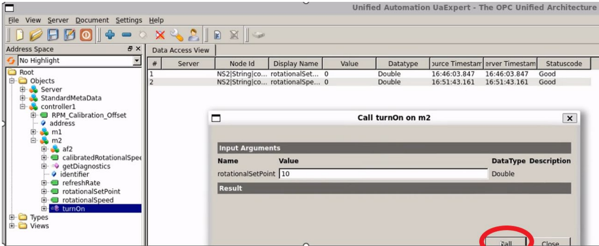
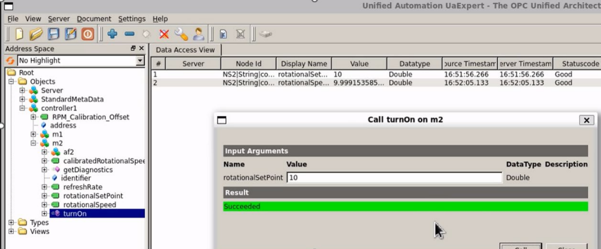
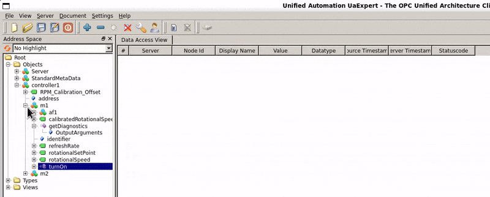
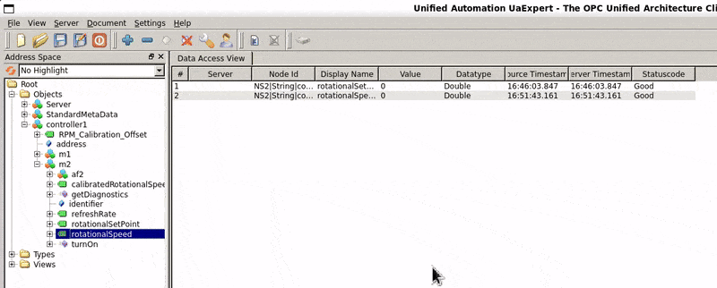

# CERN Quasar Introductory OPC UA Server

This project was my **first hands-on training at CERN** during my summer internship 2025, where I learned to develop OPC UA servers using **C++** and the Quasar framework. The project allowed me to practice hierarchical class design, implement cache variables, and test server behavior in real time using UaExpert.

OPC Unified Architecture (OPC UA) is a widely used industrial communication protocol for secure, reliable, and platform-independent data exchange in automation systems. The Quasar framework simplifies OPC UA server development by providing structured project templates, class scaffolding, and cache variable management.

---

## Project Overview

The objective of this project was to:

* **Build familiarity** with OPC UA server creation and configuration.
* **Design hierarchical class structures** with parent and child objects.
* **Implement cache variables** (read-only and read/write).
* **Test server functionality** and method invocation in real-time.
* **Document the project** using Quasar tools.

### Class Hierarchy

The server consists of the following main classes:

* **Controller** (parent class): Contains Motor objects.
* **Motor** (child class): 0–4 objects per Controller.
    * **Cache Variables**: `rotationalSpeed` (read-only), `refreshRate` (read-only), `rotationalSetPoint` (read/write).
    * **Method**: `turnOn(Double)` sets the `rotationalSetPoint`.
* **TemperatureProbe**: Optional, multiple per Motor.
* **AirflowProbe**: Mandatory, exactly one per Motor.

> [!IMPORTANT]
> Each Motor object must have exactly one AirflowProbe; otherwise, the server throws a runtime error during initialization.


---

## Implementation and Validation

### Step 1: Subscribe to rotationalSpeed variable in UaExpert
This demonstrates how the server updates the read-only cache variable automatically when the set point changes.


### Step 2: Call the turnOn() method
Invoking the method sets the `rotationalSetPoint` of a Motor.



### Step 3: Observe rotationalSpeed reaching set point
The `rotationalSpeed` variable adjusts to match the `rotationalSetPoint` based on the internal update logic.



### Step 4: Drag & Drop Motor objects
Interactively adding Motors (`m1`, `m2`) and their respective cache variables in UaExpert.



### Step 5: TurnOn Demo in Action
Demonstrates the real-time effect of the `turnOn()` method on the rotational speed of Motor objects.



---

## Example C++ Code

### Controller Class Update Logic
The Controller iterates through its children to trigger their specific update cycles.

```cpp
/* ========================== Controller Class ========================== */
void DController::update(){
    for(DMotor* motor : motors()){
        motor->update();
    }
}
```
### Motor Class Implementation
Handles the logic for speed convergence and processes method calls from the client.
```cpp
void DMotor::update() {
    // Update rotational speed based on setpoint
    m_rotationalSpeed = 0.9*m_rotationalSpeed + 0.1*getAddressSpaceLink()->getRotationalSetPoint();
    getAddressSpaceLink()->setRotationalSpeed(m_rotationalSpeed, OpcUa_Good);

    // From clients to server
    OpcUa_Double rotationalSetPoint = getAddressSpaceLink()->getRotationalSetPoint();
    LOG(Log::INF) << "Update(), setpoint " << rotationalSetPoint;
}

// Method to turn on the motor
UaStatus DMotor::callTurnOn(OpcUa_Double rotationalSetPoint) {
    if(m_rotationalSpeed > 0.1) return OpcUa_BadInvalidState;
    getAddressSpaceLink()->setRotationalSetPoint(rotationalSetPoint, OpcUa_Good);
    return OpcUa_Good;
}
```
---

## Key Features

* **OPC UA Server:** Fully implemented in **C++** using the **Quasar framework**.
* **Hierarchical Structure:** Designed with an object-oriented approach: `Controller` → `Motor` → `Probes`.
* **Validation:** Real-time server testing and monitoring using **UaExpert**.
* **Variable Management:** Implementation of both **read-only** and **read/write** cache variables.
* **Method Invocation:** Functional `turnOn` method with live variable updates and state validation.
* **Documentation:** Automated technical documentation generated via Quasar built-in tools.

---

## Technologies Used

* **Languages:** * **C++** (62%): Core server logic and class implementation.
    * **Python** (17%): Scripting and automation.
    * **Jinja2**: (15%) Template engine for code generation.
    * **CMake** (5%): Build system.
    * **C** (0.2%): Low-level components.
* **Tools & Frameworks:**
    * **Quasar Framework:** For OPC UA server scaffolding and modeling.
    * **UaExpert:** Industrial client for testing and variable subscription.
    * **Environment:** Developed in a **WSL / Linux** environment.

---

## Learning Outcomes

* **Object-Oriented Logic:** Gained hands-on experience with C++ class hierarchies and OPC UA information models.
* **Real-time Systems:** Implemented and tested cache variables and method calls with live feedback.
* **Validation & Debugging:** Learned to troubleshoot server behavior using industry-standard tools like UaExpert.
* **Professional Standards:** Developed skills in documentation and version control essential for large-scale engineering projects.
* **Industrial Best Practices:** Understood software engineering workflows within the context of automation systems.

